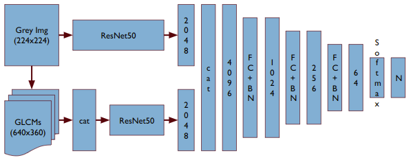
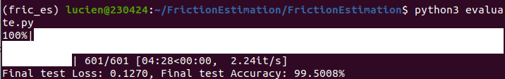
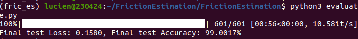
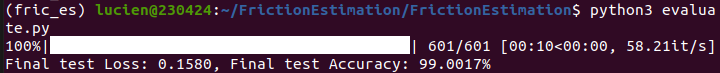
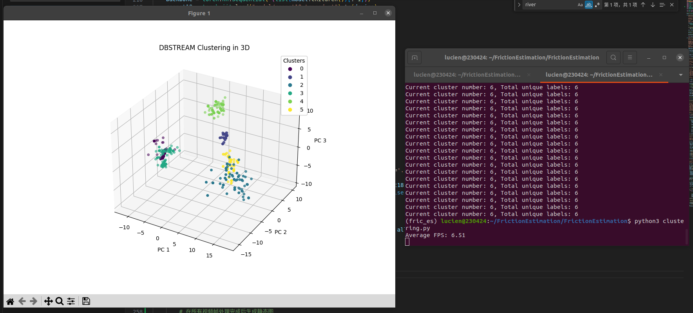

# FrictionEstimation
A Tire-Road Friction Coefficient estimation method based on camera-informing and dynamic analysis.

## 1. Camera-based Informing

This part gives a classification result of the surface by analyzing the texture of the surface through GLCM((Gray Level Co-occurrence Matrix)) and extracting fueature by pretrained ResNet. Later we will use this classification to inform the dynamic model.

### 1.1 NetWork Architecture



### 1.2 Files

-  `/data`: ground truth videos, classified images(training, dev and test data);
-  `/data/dataset.py`: Pytorch Dataset Class, used for Dataloader;
-  `/data/data_preprocess.py`: Convert videos to imgs and split into train, dev and test sets;
-  `/model`: trained models and checkpoints;
-  `train.py`: main training script;
-  `evaluate.py`: run model on test set to evaluate it;
-  `model.py`: definition of the NN and the layers;
-  `util.py`: helper functions, like the implementation of glcm.

### 1.3 Commands

To train the model, run (set up the WANDB_API_KEY in util.py if using wandb):

```
python3 train.py --use_wandb --experiment_name="your-experiment-name" --batch_size=40 --lr=0.001 --lr_decay=0.1 --max_epoch=40 --num_workers=12 --drop_out=0.1
```
To evaluate on test, run:
```
python3 evaluate.py
```

### 1.4 Current Performance

- 06.23 Using ResNet50



- 06.30 Using ResNet18



- 06.30 Using TensorScript for Acceleration



- 07.02 Stream Clustering using DBStream



